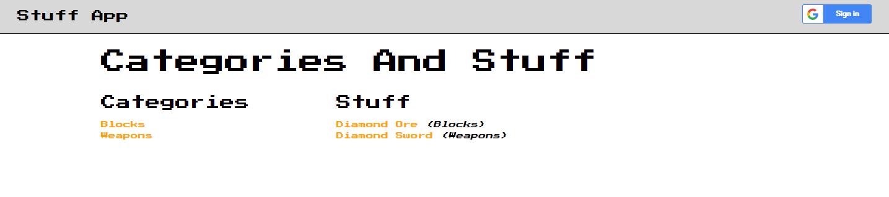

Stuff App
=========

This web application displays some stuff grouped by categories, and lets the
user add and remove their own stuff and categories.

## How To Run

1. Clone this repository to a location that is accessible by [Udacity's fullstack-nanodegree-vm](http://github.com/udacity/fullstack-nanodegree-vm).
1. `vagrant up` and `vagrant ssh` into the aforementioned vm and navigate to
the `catalog` folder from this repository.
1. Inside the `catalog` folder, run the following command:
```
python application.py
```
1. Open a web browser and navigate to the this address:
```
http://localhost:8000/
```
You should now see the application:


## How To Use

Users can navigate the categories and stuff by selecting the appropriate links.
If this is the first time the app has been run, the database may be empty,
in which case the user needs to log in to add categories and stuff.

Once logged in, users can add categories and stuff via the `add ...` links.

### How To Log In

Just select the Google Sign In button at the top right-hand corner of the app:

